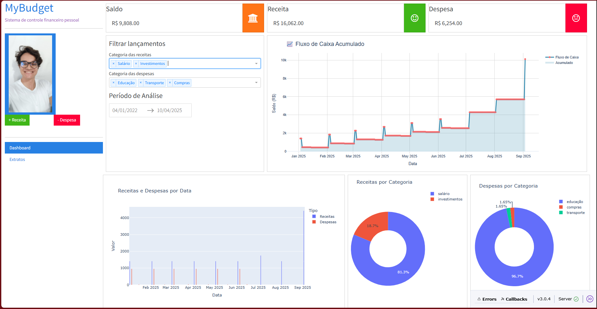
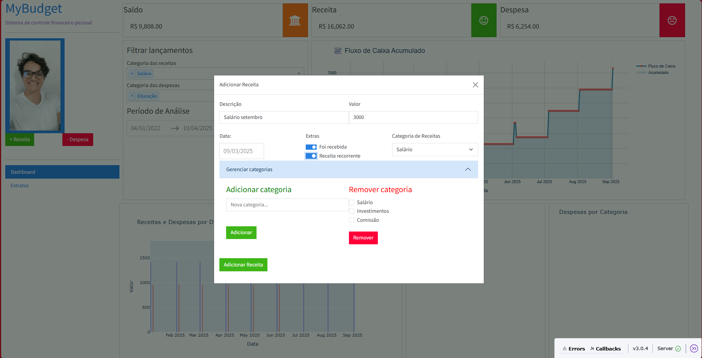
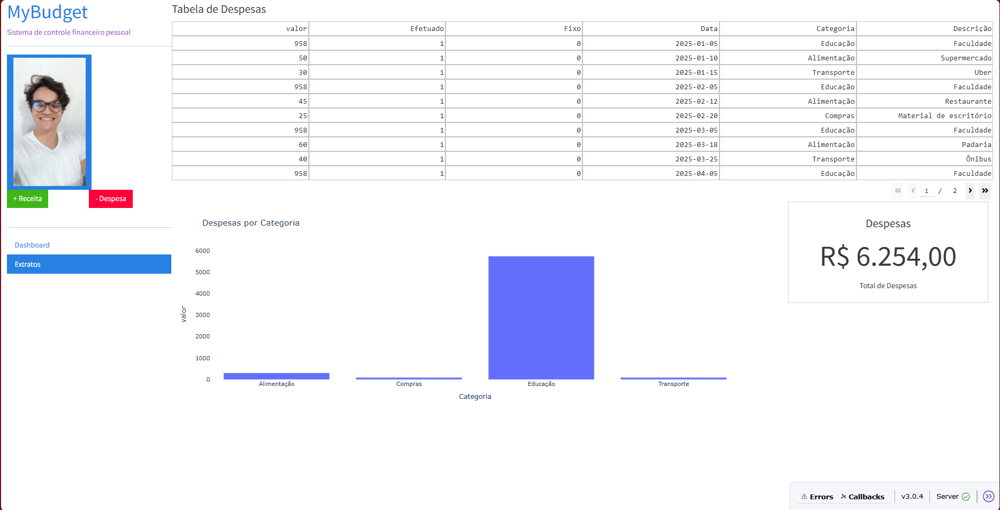

# MyBudget - Sistema de Controle Financeiro Pessoal

Este projeto é um sistema web de controle financeiro pessoal desenvolvido em Python com [Dash](https://dash.plotly.com/), [Dash Bootstrap Components](https://dash-bootstrap-components.opensource.faculty.ai/) e [Plotly]. Ele permite cadastrar receitas e despesas, visualizar gráficos interativos, gerenciar categorias e acompanhar o saldo em tempo real.

## Funcionalidades

- Cadastro de receitas e despesas com categorias personalizadas
- Visualização de saldo, receitas e despesas em cards dinâmicos
- Gráficos interativos de fluxo de caixa, barras e rosca (pie/donut)
- Filtros por período e categoria
- Tabela de extrato detalhado
- Persistência dos dados em arquivos CSV
- Interface responsiva e moderna

### Demonstração visual

  
*Dashboard inicial com resumo de receitas e despesas*

  
*Gráfico de despesas por categoria*

  
*Tabela de extrato detalhado*

## Estrutura do Projeto

```
financas_python/
│
├── MyBudget/
│   ├── app.py                # Instância principal do Dash
│   ├── myindex.py            # Layout principal e roteamento
│   ├── my_globals.py         # Variáveis globais e carregamento inicial de dados
│   ├── components/
│   │   ├── sidebar.py        # Menu lateral, modais e callbacks de cadastro
│   │   ├── dashboards.py     # Dashboard principal e gráficos
│   │   ├── extratos.py       # Página de extratos e tabela de despesas
│   ├── assets/               # Imagens, CSS e arquivos estáticos
│   ├── df_receitas.csv       # Dados de receitas
│   ├── df_despesas.csv       # Dados de despesas
│   ├── df_cat_receitas.csv   # Categorias de receitas
│   ├── df_cat_despesas.csv   # Categorias de despesas
│
└── README.md
```

## Como executar

1. **Instale as dependências:**

```bash
pip install dash dash-bootstrap-components pandas plotly
```

2. **Execute o projeto:**

```bash
python MyBudget/myindex.py
```

3. **Acesse no navegador:**

```
http://localhost:8050
```

## Observações

- Os dados são salvos automaticamente nos arquivos CSV. Ao atualizar a página, os lançamentos permanecem.
- Para adicionar novas categorias, utilize os modais de cadastro.
- O projeto é modular e fácil de expandir para novas funcionalidades.

## Créditos

Desenvolvido por Lucas com auxílio do GitHub Copilot.

---

**Dica sênior:**  
Mantenha os arquivos CSV organizados e faça backups periódicos.  
Para produção, considere usar um banco de dados relacional para maior segurança
